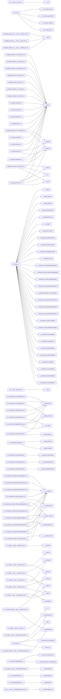

# Dependency Graph Visualization

```mermaid
graph LR
  bin___tests___cli_test_ts --> ___cli
  bin_cli_ts --> ___src_engine_parser
  bin_cli_ts --> ___src_engine_specBuilder
  bin_cli_ts --> ___src_engine_renderer
  bin_cli_ts --> ___src_engine_types
  packages_analyzer_src___tests___analyzer_test_ts --> ___index
  packages_analyzer_src_extractors_d_ts --> __types
  packages_analyzer_src_extractors_ts --> __types
  packages_analyzer_src_specBuilder_d_ts --> __types
  packages_analyzer_src_specBuilder_ts --> __types
  packages_analyzer_src_specBuilder_ts --> __classifier
  packages_analyzer_src_specBuilder_ts --> __extractors
  packages_parser_src___tests___parser_test_ts --> ___index
  packages_parser_src_parser_d_ts --> __types
  packages_parser_src_parser_ts --> __types
  packages_renderer_src___tests___renderer_test_ts --> ___index
  packages_renderer_src_contrast_ts --> __types
  packages_renderer_src_renderer_ts --> __types
  packages_renderer_src_renderer_ts --> __themes
  packages_renderer_src_renderer_ts --> __qr
  packages_renderer_src_renderer_ts --> __icons
  packages_renderer_src_themes_ts --> __types
  src_App_tsx --> __engine
  src_App_tsx --> __engine_themes
  src_App_tsx --> __engine_contrast
  src_App_tsx --> __storage_ProjectStorage
  src_App_tsx --> __ui_KeyboardShortcuts
  src_App_tsx --> __ui_haptics
  src_App_tsx --> __components_Header
  src_App_tsx --> __components_MarkdownEditor
  src_App_tsx --> __components_SectionControls
  src_App_tsx --> __components_InfographicCanvas
  src_App_tsx --> __components_Toast
  src_App_tsx --> __components_mobile_BottomNavigation
  src_App_tsx --> __components_mobile_FullScreenModalEditor
  src_App_tsx --> __components_mobile_MobileInlineEditor
  src_App_tsx --> __components_mobile_MobileTopRepoBar
  src_App_tsx --> __components_mobile_ThemeCarousel
  src_App_tsx --> __components_mobile_VisualFormatPicker
  src_App_tsx --> __components_mobile_MobileExportSheet
  src_App_tsx --> __components_mobile_MobileActionSheet
  src_App_tsx --> __components_mobile_MobileFab
  src_App_tsx --> __components_mobile_MobileCoachMarks
  src_App_tsx --> __components_ProjectsModal
  src_App_tsx --> __components_ShareModal
  src_App_tsx --> __components_WorkflowModal
  src_App_tsx --> __components_ArchitectureModal
  src_App_tsx --> __components_InfoModal
  src_App_tsx --> __components_ContrastModal
  src_App_tsx --> __components_ShortcutsModal
  src_App_tsx --> __components_GroundingModal
  src___tests___App_test_tsx --> ___App
  src_components_ContrastModal_tsx --> ___engine_types
  src_components_ContrastModal_tsx --> ___engine_contrast
  src_components_DensitySelector_tsx --> ___engine_types
  src_components_DensitySelector_tsx --> ___ui_haptics
  src_components_GroundingModal_tsx --> ___engine_types
  src_components_Header_tsx --> ___engine_themes
  src_components_Header_tsx --> ___engine_samples
  src_components_InfographicCanvas_tsx --> ___engine_types
  src_components_InfographicCanvas_tsx --> ___engine_contrast
  src_components_InfographicCanvas_tsx --> ___ui_haptics
  src_components_MarkdownEditor_tsx --> ___engine_types
  src_components_ProjectsModal_tsx --> ___storage_ProjectStorage
  src_components_SectionControls_tsx --> ___engine_types
  src_components_SectionControls_tsx --> __DensitySelector
  src_components_ShortcutsModal_tsx --> ___ui_KeyboardShortcuts
  src_components_WorkflowModal_tsx --> ___engine_workflowTemplate
  src_components_mobile_BottomNavigation_tsx --> ______ui_haptics
  src_components_mobile_FullScreenModalEditor_tsx --> ______engine_types
  src_components_mobile_FullScreenModalEditor_tsx --> ______engine_samples
  src_components_mobile_FullScreenModalEditor_tsx --> ______ui_haptics
  src_components_mobile_MobileActionSheet_tsx --> ______ui_haptics
  src_components_mobile_MobileCoachMarks_tsx --> ______ui_haptics
  src_components_mobile_MobileExportSheet_tsx --> __VisualFormatPicker
  src_components_mobile_MobileExportSheet_tsx --> ______engine_types
  src_components_mobile_MobileExportSheet_tsx --> ______ui_haptics
  src_components_mobile_MobileFab_tsx --> ______ui_haptics
  src_components_mobile_MobileInlineEditor_tsx --> ______engine_samples
  src_components_mobile_MobileInlineEditor_tsx --> ______ui_haptics
  src_components_mobile_MobileTopRepoBar_tsx --> ______engine_samples
  src_components_mobile_MobileTopRepoBar_tsx --> ______ui_haptics
  src_components_mobile_ThemeCarousel_tsx --> ______engine_themes
  src_components_mobile_ThemeCarousel_tsx --> ______ui_haptics
  src_components_mobile_VisualFormatPicker_tsx --> ______ui_haptics
  src_engine___tests___classifier_test_ts --> ___classifier
  src_engine___tests___contrast_test_ts --> ___contrast
  src_engine___tests___contrast_test_ts --> ___themes
  src_engine___tests___extractors_test_ts --> ___extractors
  src_engine___tests___extractors_test_ts --> ___types
  src_engine___tests___parser_test_ts --> ___parser
  src_engine___tests___parser_test_ts --> ___extractors
  src_engine___tests___qr_test_ts --> ___qr
  src_engine___tests___renderer_test_ts --> ___renderer
  src_engine___tests___renderer_test_ts --> ___types
  src_engine___tests___specBuilder_test_ts --> ___specBuilder
  src_engine___tests___specBuilder_test_ts --> ___parser
  src_engine___tests___specBuilder_test_ts --> ___types
  src_engine_classifier_ts --> __types
  src_engine_contrast_ts --> __types
  src_engine_extractors_ts --> __types
  src_engine_github_ts --> __types
  src_engine_parser_ts --> __types
  src_engine_parser_ts --> __classifier
  src_engine_parser_ts --> __extractors
  src_engine_renderer_ts --> __types
  src_engine_renderer_ts --> __themes
  src_engine_renderer_ts --> __extractors
  src_engine_renderer_ts --> __qr
  src_engine_renderer_ts --> __icons
  src_engine_samples_ts --> __types
  src_engine_specBuilder_ts --> __types
  src_engine_specBuilder_ts --> __classifier
  src_engine_specBuilder_ts --> __extractors
  src_engine_themes_ts --> __types
  src_export___tests___CanvasExporter_test_ts --> ___CanvasExporter
  src_main_tsx --> __App
  src_main_tsx --> __components_ErrorBoundary
  src_main_tsx --> __index_css
  src_renderer_themes___tests___ThemeManager_test_ts --> ___ThemeManager
  src_renderer_themes___tests___contrast_test_ts --> ___contrast
  src_renderer_themes___tests___contrast_test_ts --> ___ThemeManager
  src_storage_ProjectStorage_ts --> ___export_CanvasExporter
  src_storage_ProjectStorage_ts --> ___renderer_themes_ThemeManager
  src_storage___tests___ProjectStorage_test_ts --> ___ProjectStorage
  src_ui_OfflineIndicator_tsx --> __useOnlineStatus
  src_ui_PWAInstallButton_tsx --> __usePWAInstall
  src_ui___tests___KeyboardShortcuts_test_ts --> ___KeyboardShortcuts
```